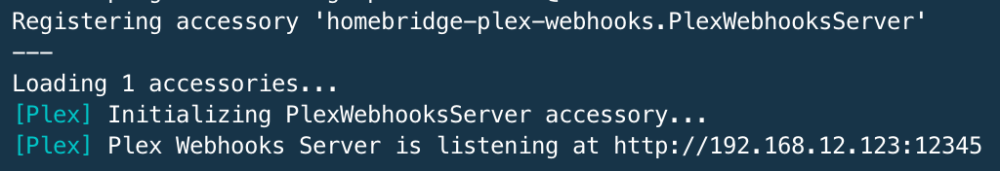
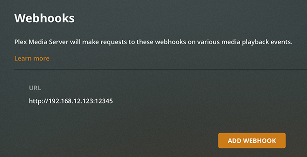

# Plex Webhooks Server plugin for Homebridge
[](https://www.npmjs.com/package/homebridge-plex-webhooks)
[](https://www.npmjs.com/package/homebridge-plex-webhooks)

This plugin based on [Plex Webhooks](https://support.plex.tv/articles/115002267687-webhooks/) which can provide smooth and fast automation experience. It creates an occupancy sensor in your Home app what can be used to create custom automations like triggering movie lights.

Please note, Webhooks are a premium feature and require an active [Plex Pass Subscription](https://support.plex.tv/articles/categories/intro-to-plex/plex-pass-subscriptions/) for the Plex Media Server account. In case you don't own Plex Pass Subscription, check out this plugin as an alternate: [homebridge-plex-v2](https://github.com/iharosi/homebridge-plex-v2)

## Installation

This plugin is published through NPM and should be installed „globally”:

```bash
sudo npm install -g --unsafe-perm homebridge-plex-webhooks
```

If you don't have a Homebridge installation yet, head over to the [project documentation](https://github.com/homebridge/homebridge) for more information.

## Configuration

You can use the following options in your homebridge config:

Variable | Optional/Required | Description
-------- | ----------------- | -----------
`accessory` | **required** | Must be `PlexWebhooksServer`.
`name` | **required** | Whatever you want the accessory to be named in Home app.
`host` | optional | In case you have multiple interfaces with multiple IP addresses, you can set where the server should listen on. Defaults to your primary interface.
`port` | optional | The port where the server should listen on. Defaults to **32401**.
`filter` | optional | An array of filter rulesets. You will get ideas from the [Webhooks support article](https://support.plex.tv/articles/115002267687-webhooks/#toc-3). You can find your payload in your homebridge log if you run homebridge in debug mode: `homebridge --debug`.

Sample config:

```json
  "accessories": [
    {
      "accessory": "PlexWebhooksServer",
      "name": "Plex",
      "host": "192.168.12.123",
      "port": "12345",
      "filter": [
        {
          "Account.title": "plex-user",
          "Player.title": "player-name"
        },
        {
          "Account.title": "other-plex-user",
          "Player.title": "other-player-name",
          "Metadata.librarySectionType": "movie"
        },
        {
          "Server.title": "other-plex-server-name",
          "Account.title": "other-plex-user",
          "Player.title": "other-player-name",
          "Metadata.librarySectionType": "show"
        }
      ]
    }
  ]
```

In case you have multiple [PMS](https://www.plex.tv/media-server-downloads/), you have to use different ports, and add every server URL to PMS webhooks.  
**Please note**, PMS will push payload to every defined webhook URL, so you need to use filter to differentiate them. Example:

```json
"accessories": [
  {
    "accessory": "PlexWebhooksServer",
    "name": "Plex - Living room",
    "port": "32000",
    "filter": [
      {
        "Server.title": "living-room-pms",
        "Player.title": "apple-tv"
      },
    ]
  },
  {
    "accessory": "PlexWebhooksServer",
    "name": "Plex - Bedroom",
    "port": "21000",
    "filter": [
      {
        "Server.title": "bedroom-pms",
        "Player.title": "mac-pro"
      },
    ]
  }
]
```

## Set up Plex Media Server

After you launch homebridge, look for the listening URL:  



Add this URL as a webhook URL on your [Plex Media Server Webhooks settings page](https://app.plex.tv/desktop#!/settings/webhooks):  



## Issues, feature requests

Before you [raise a ticket](https://github.com/iharosi/homebridge-plex-webhooks/issues/new/choose), try to run Homebridge with the `--debug` option and look for the payload in console. Make sure your config is valid and your filter rules are correct.

In case you would like to suggest a feature feel free to open a ticket and use the `feature request` label.
